---

# 🧠 MRI-to-Synthetic CT Brain Scan Translation using Deep Learning

🚀 **A Capstone Project by Meet Jani**
🎓 *Indian Institute of Technology (IIT) Mandi, in collaboration with Masai School*

---

## 📖 Project Overview

This project focuses on generating **synthetic CT brain scans from MRI inputs** using **deep learning**.

MRI offers excellent soft-tissue contrast, whereas CT provides superior bone and density visualization. However, acquiring both increases patient cost and radiation exposure.

To address this, I developed multiple **deep learning architectures** — from classical **U-Net** to advanced **Pix2Pix GAN** and **Swin Transformer-based** models — to perform **MRI → CT translation** with high accuracy and perceptual realism.

---

## 🎯 Objectives

✅ Develop models that generate CT-equivalent images from MRI slices.
✅ Compare architectures across **MAE**, **MSE**, **PSNR**, and **SSIM** metrics.
✅ Design efficient preprocessing and **RAM caching** pipelines.
✅ Deploy a **Gradio web app** for real-time inference and visualization.

---

## 📂 Dataset

**Dataset:** [SynthRAD2023 Brain Task-1](https://synthrad2023.grand-challenge.org)
**Samples:** 180 paired T1-weighted MRI and CT volumes

### 🧩 Preprocessing Pipeline

* 3D MRI/CT volume alignment → 2D paired slice generation
* Intensity normalization per slice
* Optional brain masking for intracranial focus
* Data augmentation (flips, rotations, brightness/contrast, Gaussian noise)
* **RAM caching** for fast data loading during training

---

## 🧠 Model Architectures

| Model               | Generator               | Discriminator | Loss Functions          | Notes                   |
| ------------------- | ----------------------- | ------------- | ----------------------- | ----------------------- |
| **UNet**            | UNet                    | None          | L1                      | Baseline                |
| **Pix2Pix**         | UNet                    | PatchGAN      | L1 + Adversarial        | Best overall trade-off  |
| **Pix2Pix-ResUNet** | ResUNet                 | PatchGAN      | L1 + SSIM + Adversarial | Sharper details         |
| **SwinPix2Pix**     | UNet + Swin Transformer | PatchGAN      | L1 + Adversarial        | Long-range dependencies |
| **SwinGAN**         | SwinUNet                | PatchGAN      | L1 + SSIM + Adversarial | Transformer-based GAN   |

**Optimizer:** Adam (lr = 0.0002, β₁ = 0.5, β₂ = 0.999)
**Batch Size:** 4–12 slices (GPU dependent)
**Precision:** Mixed (AMP)

---

## 🧠 Pix2Pix Architecture (MRI + Mask → CT)

### Model Overview

**Input:** MRI + Mask (2 channels, 256×256)
**Output:** CT (1 channel, 256×256)

```
-------------------------------------------------
                 ┌───────────────────────────────┐
                 │       U-Net Generator         │
                 │  (Encoder–Decoder with skips) │
                 └───────────────────────────────┘
                            │
                            ▼
                 ┌───────────────────────────────┐
                 │     PatchGAN Discriminator     │
                 │  (classifies real/fake patches)│
                 └───────────────────────────────┘
```

---

### 🧩 U-Net Generator

**Architecture used:** `UNet(in_ch=2, out_ch=1, features=[32,64,128,256])`

**Encoder (Downsampling Path)**

| Layer | Operation   | In → Out Channels | Kernel | Stride | Output Size | Activation |
| ----- | ----------- | ----------------: | :----: | :----: | :---------: | :--------: |
| 1     | Double Conv |            2 → 32 |   3×3  |    1   |   256×256   |    ReLU    |
| 2     | MaxPool     |                 — |   2×2  |    2   |   128×128   |      —     |
| 3     | Double Conv |           32 → 64 |   3×3  |    1   |   128×128   |    ReLU    |
| 4     | MaxPool     |                 — |   2×2  |    2   |    64×64    |      —     |
| 5     | Double Conv |          64 → 128 |   3×3  |    1   |    64×64    |    ReLU    |
| 6     | MaxPool     |                 — |   2×2  |    2   |    32×32    |      —     |
| 7     | Double Conv |         128 → 256 |   3×3  |    1   |    32×32    |    ReLU    |
| 8     | MaxPool     |                 — |   2×2  |    2   |    16×16    |      —     |

**Bottleneck**

| Layer | Operation   | In → Out Channels | Output Size |
| ----- | ----------- | ----------------: | :---------: |
| 9     | Double Conv |         256 → 512 |    16×16    |

**Decoder (Upsampling Path)**

| Step | Operation                | Concat Skip | In → Out Channels | Output Size |
| ---- | ------------------------ | ----------: | ----------------: | :---------: |
| 10   | ConvTranspose            |           — |        1024 → 256 |    32×32    |
| 11   | Double Conv (+ skip 256) |   512 → 256 |             32×32 |             |
| 12   | ConvTranspose            |           — |         512 → 128 |    64×64    |
| 13   | Double Conv (+ skip 128) |   256 → 128 |             64×64 |             |
| 14   | ConvTranspose            |           — |          256 → 64 |   128×128   |
| 15   | Double Conv (+ skip 64)  |    128 → 64 |           128×128 |             |
| 16   | ConvTranspose            |           — |          128 → 32 |   256×256   |
| 17   | Double Conv (+ skip 32)  |     64 → 32 |           256×256 |             |
| 18   | Final Conv               |           — |            32 → 1 |   256×256   |

---

### ⚙️ PatchGAN Discriminator

**Architecture used:** `PatchDiscriminator(in_ch=3)`
(input = concatenation of [input(2ch), target(1ch)] = 3ch)

| Layer | Operation | In → Out Channels | Kernel | Stride |    Norm   |   Activation   |
| ----- | --------- | ----------------: | :----: | :----: | :-------: | :------------: |
| 1     | Conv2d    |            3 → 64 |   4×4  |    2   |    None   | LeakyReLU(0.2) |
| 2     | Conv2d    |          64 → 128 |   4×4  |    2   | BatchNorm | LeakyReLU(0.2) |
| 3     | Conv2d    |         128 → 256 |   4×4  |    2   | BatchNorm | LeakyReLU(0.2) |
| 4     | Conv2d    |           256 → 1 |   4×4  |    1   |    None   |        —       |

**Output:**
→ Patch of logits (approx 16×16 map of real/fake scores)
→ `BCEWithLogitsLoss` applied directly (no sigmoid inside model).

---

### 🧮 Loss Functions & Training Hyperparams

| Component         | Loss Type        | Formula                                         |
| ----------------- | ---------------- | ----------------------------------------------- |
| **Generator**     | Adversarial + L1 | 𝐿_G = BCE(G(x), 1) + λ × L1(G(x), y)           |
| **Discriminator** | Adversarial      | 𝐿_D = ½ [BCE(D(x, y), 1) + BCE(D(x, G(x)), 0)] |
| **Validation**    | L1 + SSIM        | 𝐿_val = L1(G(x), y) + SSIM(G(x), y)            |

* λ (L1 weight) = **100**
* Optimizer (G & D) = **Adam(lr=2e-4, betas=(0.5, 0.999))**
* Mixed Precision = **Yes** (`torch.amp.autocast`)
* Early Stopping = **patience=5**

**Summary**

* Image size: **256×256**
* Input: **MRI (1ch)** + **mask (1ch)** = **2 channels**
* Output: **CT (1ch)**
* Generator: **UNet-based**
* Discriminator: **PatchGAN**
* Total parameters: **~54M** (approx; varies slightly with BN layers)

---

### 📉 Training Loss Curves

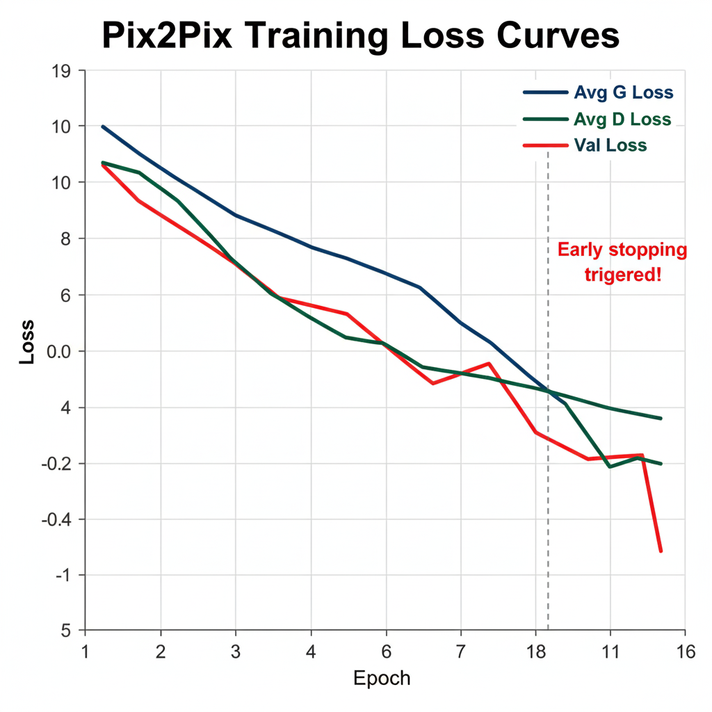

> The generator converges steadily with decreasing L1 and SSIM losses, while discriminator loss stabilizes near 0.6 — indicating balanced adversarial learning.

---

## 6️⃣ Quantitative Results

| **Model**           | **Dataset** | **MAE** | **MSE** | **PSNR** | **SSIM** |
| ------------------- | ----------- | ------- | ------- | -------- | -------- |
| **UNet**            | Test        | 0.2357  | 0.1967  | 20.13    | 0.7470   |
| **Pix2Pix**         | Test        | 0.1246  | 0.0954  | 23.63    | 0.8560   |
| **Pix2Pix-ResUNet** | Test        | 0.1169  | 0.0884  | 23.89    | 0.8516   |
| **SwinPix2Pix**     | Test        | 0.1596  | 0.1427  | 21.40    | 0.7798   |
| **SwinGAN**         | Test        | 0.4546  | 0.4369  | 16.48    | 0.5187   |

> 🧠 **Insights:**
>
> * **Pix2Pix** achieves the best trade-off between fidelity and computational efficiency.
> * **ResUNet** improves edge detail with marginal SSIM gain.
> * **Swin-based** models underperform due to limited data and high complexity.

---

### 📈 Quantitative Evaluation Visuals

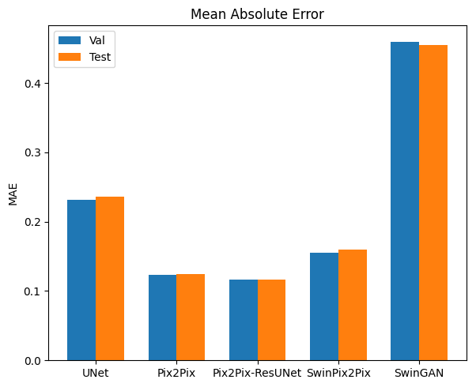
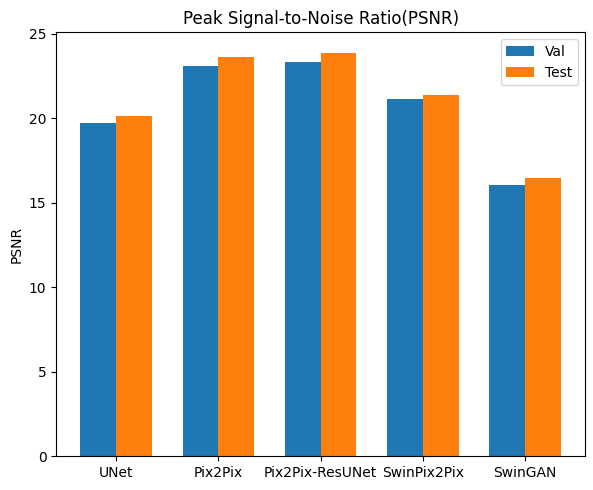
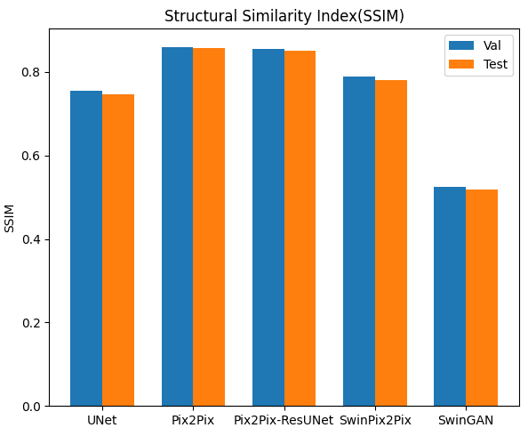
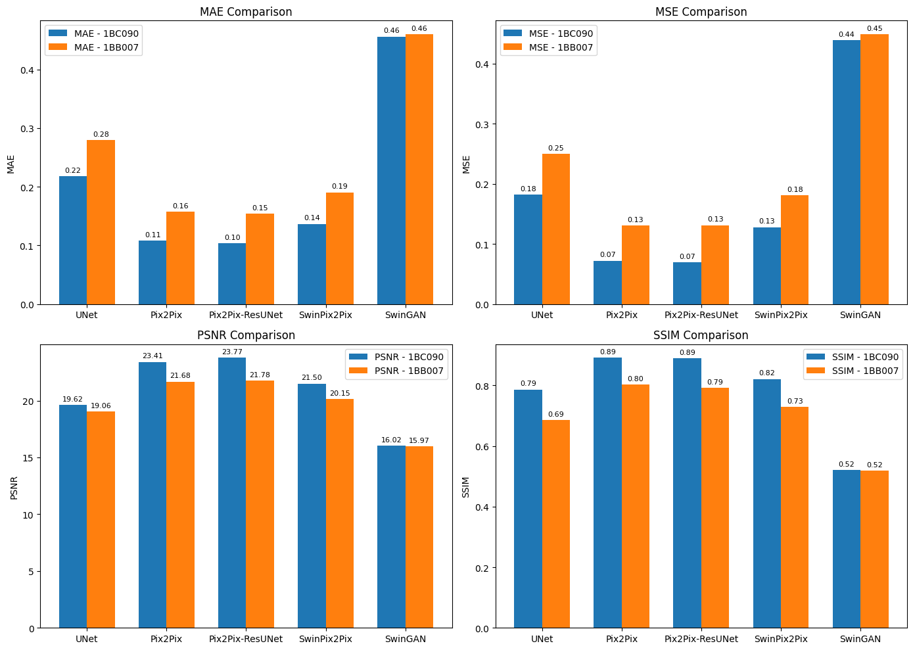

> These visual plots represent model-wise quantitative trends across patients, confirming the superiority of Pix2Pix and ResUNet variants.

---

## 7️⃣ Qualitative Results

### Representative Visuals (MRI → Ground Truth CT → Predicted CT → Absolute Error)

| **Model**           | **Example Visualization**                                 |
| ------------------- | --------------------------------------------------------- |
| **UNet**            | 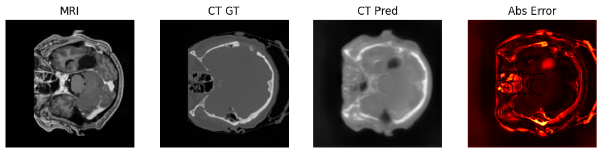               |
| **Pix2Pix**         | 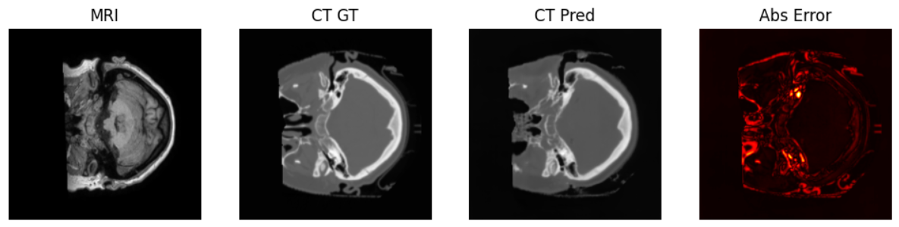         |
| **Pix2Pix-ResUNet** |          |
| **SwinPix2Pix**     | 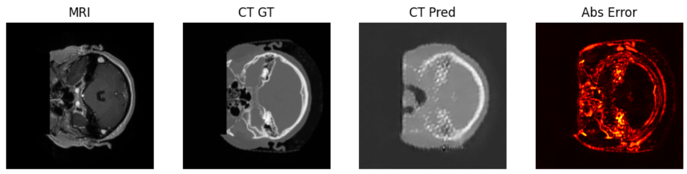 |
| **SwinGAN**         | 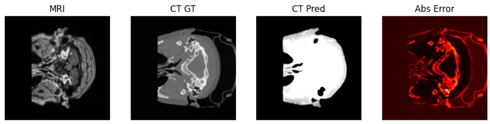         |

> 🧩 **Observations:**
>
> * **Pix2Pix** effectively captures both bone and soft-tissue contrast.
> * **Pix2Pix-ResUNet** yields sharper edges and improved cortical structure delineation.
> * **Swin-based** outputs show minor artifacts due to limited dataset size.
> * The error maps highlight minor deviations in high-density bone regions.

---

### 🧠 Visual Comparison Summary

| Input MRI               | Ground Truth CT       | Predicted CT              |
| ----------------------- | --------------------- | ------------------------- |
| 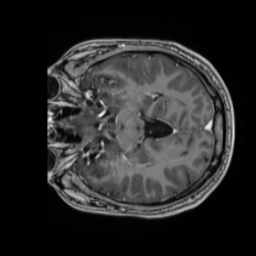 |  | 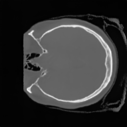 |

---

## 👨‍💻 Author

**Meet Jani**
📧 [janimeet59@gmail.com](mailto:janimeet59@gmail.com)

🔗 [**LinkedIn**](https://www.linkedin.com/in/janimeet) | [**GitHub**](https://github.com/MeetJani0)

🎓 *Minor in Data Science & Machine Learning — IIT Mandi (in collaboration with Masai School)*

---

⭐ *If you found this work useful, please consider starring the repository or connecting on LinkedIn!*

---
